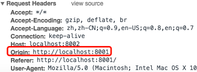
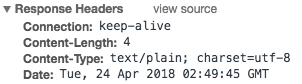
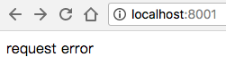
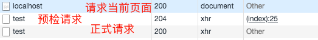
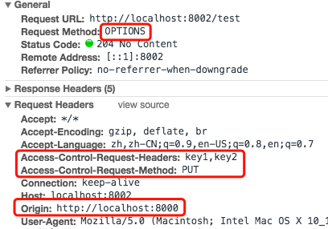
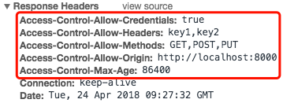
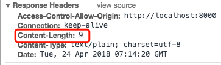
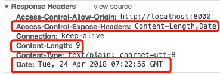
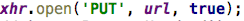
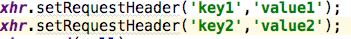

# cors（跨域）

## 介绍

> - 参见[跨域资源共享 CORS 详解](http://www.ruanyifeng.com/blog/2016/04/cors.html) 
> - 以下内容摘自[Mshuyan/Notes/nodejsNotes](https://github.com/Mshuyan/Notes/blob/master/nodejsNotes/nodejs%E7%AC%94%E8%AE%B0.docx) 

### 基础知识

- 什么是跨域

  每个服务器都有1个唯一的域名，域名由以下几部分组成：

  协议、域名、端口

  如：http:www.baidu.com:80

  当域名中存在任何一部分不同时，则认为是跨域

   如：来自[www.baodu.com](http://www.baodu.com)的页面要请求[www.google.com](http://www.google.com)的资源，就是跨域

- 浏览器如何进行跨域限制

  ​        跨域限制仅限于ajax请求

  ​        默认情况下，浏览器从互联网上请求下来的js脚本，都会记住他来自哪个域名，当某个js脚本想要发送与他的来源不同域的请求时，浏览器会先判断这是1个简单请求还是非简单请求，如果这是1个简单请求，则会自动添加1个origin请求头直接发送出去；如果是非简单请求，则会自动添加一些请求头先预检一下服务器是否允许当前域的请求，如果服务器允许，则真正的将请求发出去，否则就报错（参见[CORS请求](#CORS请求)）

  举个🌰：

  ​        现在浏览器上运行的js脚本是来自A网站的，但是该页面向B站发送了1个ajax请求，浏览器一看，你这是跨域了，就会先判断该请求是否属于简单请求，如果是，则自动添加origin请求头直接将请求发出，如果不是，则先发一个“预检”请求，如果浏览器回复允许你访问，则真正的发出请求，否则就不让发了

- 为什么要跨域

  有的时候同一个公司可能有好几个子域名，他们之间需要跨域互相访问资源

  当你的项目需要使用百度地图的api时，需要跨域让浏览器允许你的页面发送对百度地图所在的域名的请求

### 跨域方案

- jsonp

  现在没用到

- 服务器代理

  浏览器中来自A网站的资源想要请求B网站的资源时，浏览器中来自A网站的资源先请求A网站，告诉他我需要B网站的资源，A网站服务器接收到请求后由服务器去B网站拿资源，拿到后再进行响应

- CORS请求

  这是本章的重点，通过头信息实现跨域

## CORS请求

### 分类

> 浏览器将CORS请求分成两类：简单请求（simple request）和非简单请求（not-so-simple request）。只要同时满足以下两大条件，就属于简单请求。

- 请求方法是以下三种方法之一：
  - HEAD
  - GET
  - POST
- HTTP的头信息不超出以下几种字段：
  - Accept
  - Accept-Language
  - Content-Language
  - Last-Event-ID
  - Content-Type：只限于三个值application/x-www-form-urlencoded、multipart/form-data、text/plain

> 凡是不同时满足上面两个条件，就属于非简单请求。浏览器对这两种请求的处理，是不一样的。

### 简单请求

> 对于简单请求，==浏览器自动==添加1个origin请求头，并将请求直接发出

例：

- localhost:8001中的123.html

  ```html
  <body>
      <div id="div1"></div>
  </body>
  </html>
  <script type="text/javascript">
      var url = 'http://localhost:8002';
      var xhr = new XMLHttpRequest();
      xhr.onreadystatechange = function(){
          if ((xhr.readyState == 4) && (xhr.status == 200)){
              document.getElementById('div1').innerHTML += xhr.responseText;
          }
      };
      xhr.onerror = function(){
          document.getElementById('div1').innerHTML += 'request error';
      };
      xhr.open('GET', url, true);
      xhr.send(null);
  </script>
  ```

- cors简单请求的请求头

  刷新123.html页面就会发出cors请求，在控制台看到请求头如下：

   

- 服务器接收到请求后，根据请求头中Origin字段值判断是否同意这次请求。

  - 如果服务器没有实现CORS接口，或者判断Origin后，这个源不在允许范围内，则返回1个正常的响或将响应头中Access-Control-Allow-Origin字段设置为除请求头中Origin字段值以外的值。

    - 浏览器接收到响应后发现响应头没有包含Access-Control-Allow-Origin字段，或包含了Access-Control-Allow-Origin字段，但是值不是当前域名，则认为出错，被XMLRequest的onerror回调函数捕获

    - 所以上面的例程，如果返回1个普通的响应，响应头如下：

       

      页面接收到响应后显示：

       

      注意:这种错误无法通过状态码识别，因为HTTP回应的状态码有可能是200。此时onerror和onreadystatechange函数内“if ((xhr.readyState == 4) && (xhr.status == 200))”条件内的代码都会被得到执行

  - 如果服务器实现了CORS接口，并且判断Origin指定的源在允许范围内，则需要在响应头中添加Access-Control-Allow-Origin和一些其他字段，其中Access-Control-Allow-Origin的值必须为请求头中Origin字段值或“*”

    - 浏览器接收到响应后发现响应头包含Access-Control-Allow-Origin字段，并且字段值就是当前域名，就认为服务器是允许被当前域名访问的，就不会调用onerror事件，但onreadystatechange函数内“if ((xhr.readyState == 4) && (xhr.status == 200))”条件内的代码可以正常被执行。

### 非简单请求

> 非简单请求在正式请求之前，浏览器会自动增加1次预检请求，来询问服务器当前网页的域名是否在服务器的许可名单中，以及可以使用哪些请求方式和头信息字段，只有得到肯定答复，浏览器发正式发送XMLHttpRequest请求，否则报错

以如下代码为例：

```html
`<**body**>     <**div** **id=****"div1"**></**div**>   </**body**>   </**html**>   <**script** **type=****"text/javascript"**>     **var** **url** = **'http://localhost:8002/test'**;     **var** **xhr** = **new** XMLHttpRequest();     **xhr**.onreadystatechange = **function**(){         **if** ((**xhr**.**readyState** == 4) && (**xhr**.**status** == 200)){             document.getElementById(**'div1'**).**innerHTML** += **xhr**.responseText;         }     };     **xhr**.onerror = **function**(){         document.getElementById(**'div1'**).**innerHTML** += **'request error'**;     };     **xhr**.open(**'PUT'**, **url**, **true**);     **xhr**.setRequestHeader(**'key1'**,**'value1'**);     **xhr**.setRequestHeader(**'key2'**,**'value2'**);     **xhr**.**send**(**null**);   </**script**>`
```

- 该CORS请求使用PUT请求，并且设置了2个自定义请求头：key1、key2

- 刷新该页面后，控制台可以看见3次请求：

   

- 预检请求

  - 请求

    点开上图中预检请求，可以看到如下请求头信息

     

    预检请求采用OPTION请求方式

    预检请求浏览器自动在请求头中加入如下字段：

    - Origin

    - Access-Control-Request-Method

    - Access_Control_Request_Headers

      > 请求前设置了自定义请求头字段时浏览器自动添加该字段，否则不使用该字段

- 响应

  响应头中必须包含如下必选字段：

  - 如果没有包含任何CORS请求相关的字段，则浏览器认为服务器拒绝
  - 如果没有`Access_Control_Allow_Origin`字段或者该字段值不是当前网页域名或不是`*`，则表示服务器拒绝
  - 如果`Access_Control_Allow_Methods`中允许的请求方式不包括当前请求的请求方式，则浏览器认为服务器拒绝
  - 如果`Access_Control_Allow_Headers`没有全部包含当前页面的CORS请求前设置的自定义请求头字段，则浏览器认为服务器拒绝

  响应头中也可能包含如下可选字段：

  - Access_Control_Allow_Credentials
  - Access_Control_Max_Age

  如：

   ​        

 

- 正式请求

  一旦服务器通过了预检请求，以后每次浏览器正常的CORS请求，就都跟简单请求一样了

### cors头字段

- Origin

  - 用于CORS请求的请求头中
  - 用以标识发送该请求的脚本来自哪个域名
  - 该字段是浏览器自动添加上的

- Access-Control-Allow-Origin

  - 用于CORS请求的响应头中

  - 如果允许该域名的请求，该字段是必须的

  - 用于标识返回响应的服务器允许哪些域名的请求

    *：允许任意服务器访问

    具体某个服务器的全域名：允许访问的域名

    如果响应头中没有该字段，或该字段值不是当前域名，浏览器则报错

  - 该字段需要服务器代码中进行添加

- Access-Control-Allow-Credentials

  - 用于简单请求的响应头中

  - 该字段可选

  - 布尔值，标识是否允许发送cookie，如果允许，设置该字段为true；如果不允许，不使用该字段即可

  -   注意

    如果要跨域使用cookie，必须注意以下几点：

    -  Access-Control-Allow-Origin字段不能设为“*”,必须设置为与请求网页一致的域名

    - 跨域使用cookie时，cookie依然遵循同源原则，必须合理设置cookie的domain属性，跨域使用cookie时cookie才会被上传

    - 原网页中document.cookie无论如何也无法读取到跨域服务器下的cookie

- Access-Control-Expose-Headers

  - 用于CORS请求的响应头中

  - 该字段可选

  - 作用

    ​        XMLHttpRequest对象的getResponseHeader()方法只能拿到6个基本字段：Cache-Control、Content-Language、Content-Type、Expires、Last-Modified、Pragma，其他的字段即使设置到响应头中，也无法通过该方法让你拿到这个字段的值

    如：

    ​	本次响应头如下：

    ​	 

    ​	其中Content-Length字段确确实实存在响应头中，但是通过getResponseHeader()方法取该字段值返回的是null

    ​	CORS请求时，如果服务器希望浏览器中可以通过getResponseHeader()方法拿到Content-Length字段的值，就将Content-Length等字段名以数组形式设置为Access-Control-Expose-Header字段的值，浏览器就可以通过getResponseHeader()方法获取到这些字段的值了

     如：

    ​	 

    ​	Access-Control-Expose-Header字段中指定了Content-Length和Date这两个字段，则这两个字段的值就可以通过getResponseHeader()方法获取了

- Access-Control-Request-Method

  - 用于预检请求的请求头中

  - 该字段浏览器自动添加，值就是非简单请求的请求方式

    如：

    ​	 

    ​	 

- Access-Control-Request-Headers

  - 用于预检请求的请求头中

  - 该字段值为逗号分隔的字符串，内容是浏览器发送CORS请求时额外发送的自定义请求头字段名

    如：

    ​	 

    ​	 

  - 如果浏览器没有设置自定义请求头字段，则预检请求头中没有该字段

- Access-Control-Allow-Methods
  - 用于预检请求的响应头
  - 该字段值是逗号分隔的字符串，内容表示服务器允许的当前域名跨域请求的所有请求方式；如果当前页面的CORS请求的请求方式不在范围内，则浏览器抛出错误

- Access-Control-Allow-Headers
  - 用于预检请求的响应头
  - 该字段值是逗号分隔的字符串，内容表示服务器允许的当前域名跨域请求的所有自定义请求头字段;如果当前页面的CORS请求在请求之前设置的自定义字段没有全部包含在内，则浏览器抛出错误

- Access-Control-Max-Age
  - 用于预检请求的响应头
  - 该字段可选
  - 用来指定本次预检请求有效期，单位秒，在此期间，不用发出另一条预检请求
  - 如果不使用该参数，默认5s内不需要预检

## java实现

> 以下内容摘自[Mshuyan/security](https://github.com/Mshuyan/security/blob/master/spring4all/README.md#cors) 

> 未使用`security`之前配置跨域，可以使用如下方法进行配置

```java
@Bean
@Order(0)
public FilterRegistrationBean corsFilter() {
    UrlBasedCorsConfigurationSource source = new UrlBasedCorsConfigurationSource();
    CorsConfiguration config = new CorsConfiguration();
    config.setAllowCredentials(false);
    // 设置你要允许的网站域名，如果全允许则设为 *
    config.addAllowedOrigin("*");
    // 如果要限制 HEADER 或 METHOD 请自行更改
    config.addAllowedHeader("*");
    config.addAllowedMethod("*");
    config.addExposedHeader("Content-Disposition");
    source.registerCorsConfiguration("/**", config);
    return new FilterRegistrationBean<>(new CorsFilter(source));
}
```

> 使用`security`之后，因为`login`接口是由`security`提供的，所以上述方法无法对`login`接口提供跨域支持，此时需要使用`security`提供的跨域方法

在secirity配置类中：

```java
@Override
protected void configure(HttpSecurity http) throws Exception {
    http.exceptionHandling()
        .accessDeniedHandler(new CustomizeAccessDeniedHandler())
        .authenticationEntryPoint(new CustomizeAuthenticationEntryPoint())
        .and().authorizeRequests()
        .antMatchers("/**.html").permitAll()
        // 在这里配置cors
        .and().cors().configurationSource(corsConfigurationSource())
        .and().csrf().disable();
    http.addFilterAt(jwtLoginFilter(), UsernamePasswordAuthenticationFilter.class);
    http.addFilter(jwtAuthenticationFilter());
    http.sessionManagement().sessionCreationPolicy(SessionCreationPolicy.NEVER);
}

private UrlBasedCorsConfigurationSource corsConfigurationSource(){
    UrlBasedCorsConfigurationSource source = new UrlBasedCorsConfigurationSource();
    CorsConfiguration config = new CorsConfiguration();
    config.setAllowCredentials(false);
    // 设置你要允许的网站域名，如果全允许则设为 *
    config.addAllowedOrigin("*");
    // 如果要限制 HEADER 或 METHOD 请自行更改
    config.addAllowedHeader("*");
    config.addAllowedMethod("*");
    /* 非跨域请求时，服务端返回自定义的响应头前端能够获取到
     * 跨域请求中前端获取不到，则服务端需要通过配置ExposedHeader来将这些头暴露出去
     * 让前端可以获取到
     */
    config.addExposedHeader("Content-Disposition");
    source.registerCorsConfiguration("/**", config);
    return source;
}
```

